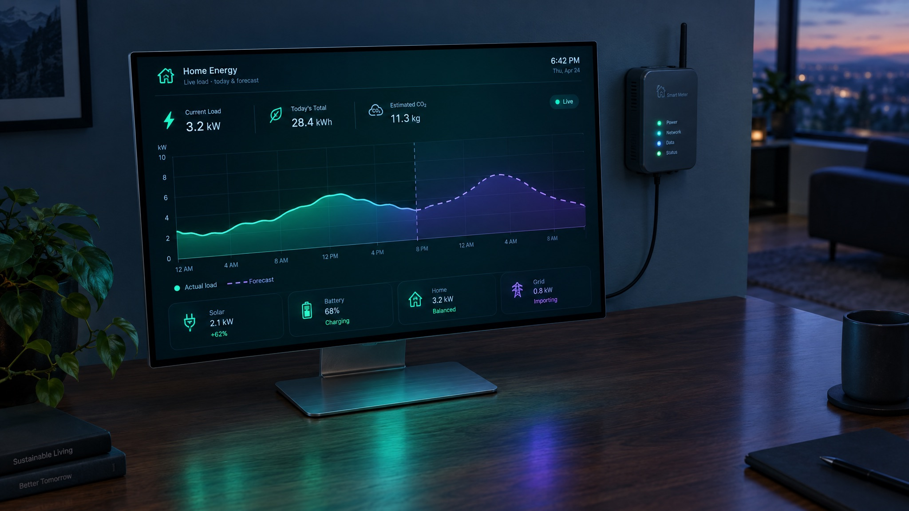
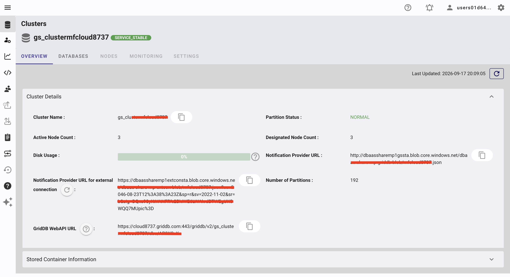
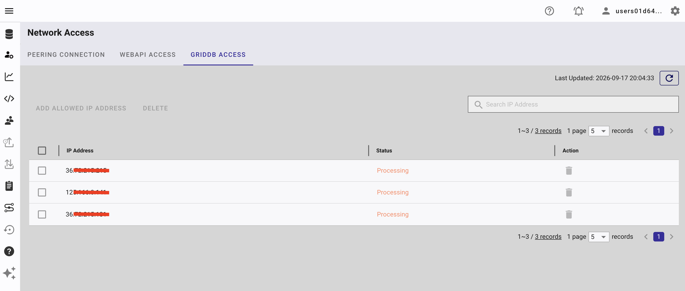
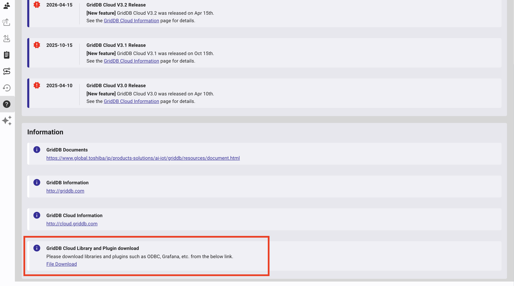
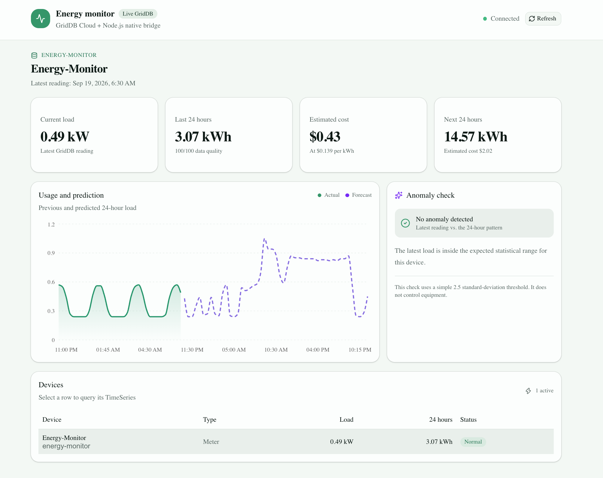
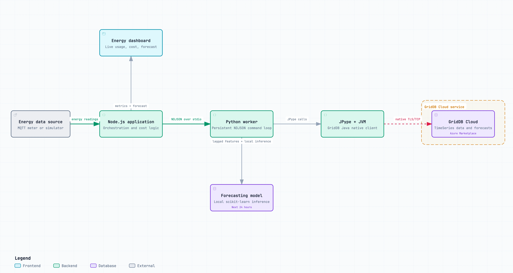
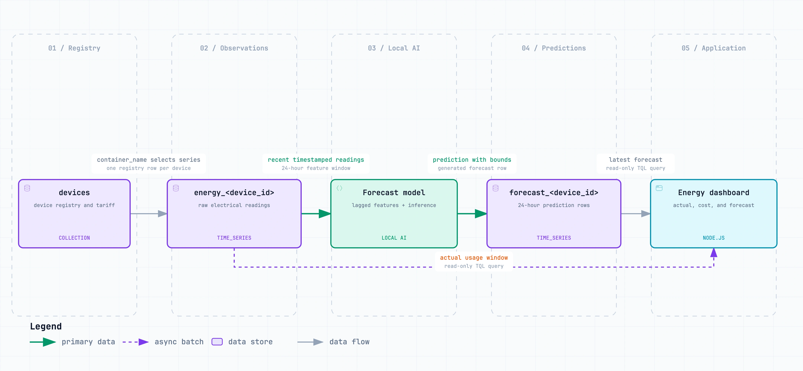
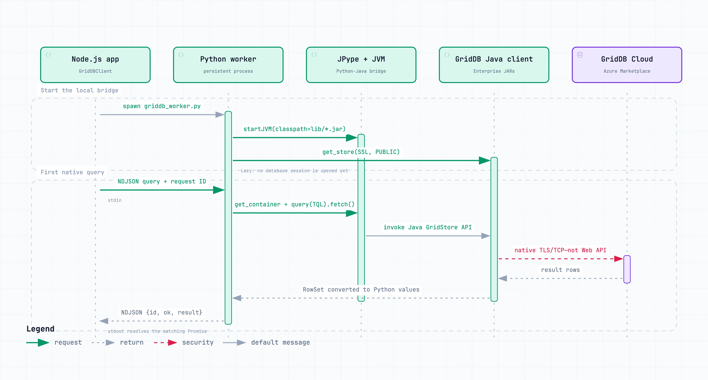

# Build an AI Energy Monitor with Node.js and GridDB Cloud Native API




## Table of Contents

- [What This Blog Is About](#what-this-blog-is-about)
- [What We Will Build](#what-we-will-build)
- [Why Use the Native GridDB Client?](#why-use-the-native-griddb-client)
- [Prerequisites](#prerequisites)
- [How to Run](#how-to-run)
- [System Architecture](#system-architecture)
- [GridDB Schema](#griddb-schema)
- [Technical Implementation](#technical-implementation)
- [Forecasting the Next 24 Hours](#forecasting-the-next-24-hours)
- [Reading Results in Node.js](#reading-results-in-nodejs)
- [Connecting a Real Electricity Meter](#connecting-a-real-electricity-meter)
- [What Uses HTTP and What Does Not?](#what-uses-http-and-what-does-not)
- [Further Enhancements](#further-enhancements)
- [Conclusion](#conclusion)

## What This Blog Is About

Electricity monitoring becomes much more useful when it can answer questions,
not only draw a chart. How much energy did an air conditioner consume today? Is
a refrigerator using more power than normal? Based on recent history, how much
electricity will this site consume during the next 24 hours?

In this guide, we build an energy-monitoring application using Node.js, Python,
and GridDB Cloud on Azure Marketplace. Node.js controls the application, Python
runs a lightweight forecasting model, and GridDB stores timestamped electricity
measurements and forecast results.


## What We Will Build

The finished prototype has four main features:

1. Generate realistic electricity readings for an air conditioner and a
   refrigerator.
2. Store voltage, current, power, and interval energy in GridDB TimeSeries
   containers.
3. Show recent readings and calculate energy cost in a Node.js dashboard.
4. Use a small machine-learning model to forecast energy consumption for the
   next 24 hours.

The first version uses simulated readings so anyone can run it without buying
hardware. At the end of the article, we show where an MQTT or Modbus electricity
meter can be connected without changing the GridDB or forecasting layers.

> **Screenshot placeholder:** Final dashboard showing live watts, today's cost,
> a 24-hour chart, and the next-day forecast.

## Why Use the Native GridDB Client?

GridDB Cloud offers a Web API, but some environments do not allow database
operations through an HTTP API. GridDB Cloud v3.2 also supports public access
from native Java and Python clients by using `connectionRoute=PUBLIC`.

For this project, the data path is:

```text
Node.js -> NDJSON over stdio -> Python/JPype -> GridDB native TLS/TCP -> GridDB Cloud
```

The current GridDB Python client is built on the GridDB Java API, JPype, and
Apache Arrow. This is useful for Node.js developers because Python can hide the
Java runtime details behind a small process bridge. Node.js sends a JSON command
and receives a JSON response while one persistent Python/JVM process owns the
database connection.

Keeping the worker alive is important. Starting a JVM for every reading would
be slow and would create unnecessary GridDB connections.

For background on the public native route, see [Connecting to GridDB Cloud v3.2
from Your Local Dev Environment](https://www.griddb.net/en/blog/connecting-to-griddb-cloud-v3-2-from-your-local-dev-environment-no-vpn-no-vnet-peering/).

## Prerequisites

### Node.js

Install Node.js 18 or newer. The sample uses only built-in Node.js modules for
the process bridge, so no HTTP framework is required for database access.

### Python

The current GridDB Python client documents Python 3.12 as a tested environment.
We use a project virtual environment so JPype, PyArrow, GridDB Python, and
scikit-learn do not affect the system Python installation.

### Java and Maven

The GridDB Python package uses the Java API through JPype. On macOS, this project
uses OpenJDK 21 and Maven installed with Homebrew.

### GridDB Cloud on Azure Marketplace

This article assumes a GridDB Cloud v3.2 service obtained through Azure
Marketplace.

For the public native route:

1. Generate the Notification Provider URL from the Cloud dashboard.




2. Add the application's stable public outbound IP to the GridDB access list.



3. Download the Enterprise Java library bundle from the Cloud Help or Downloads



4. Extract `gridstore-advanced.jar` from the downloaded RPM.

The Enterprise JAR is not published on Maven Central. It is required for the Cloud SSL connection.


## How to Run

### 1. Clone the repository

```bash
git clone https://github.com/junwatu/griddb-native-ai-energy-monitor.git
cd griddb-native-ai-energy-monitor/apps
```

### 2. Install the public dependencies

On macOS, run the included setup script:

```bash
npm install
npm run setup:mac
```

The script performs the following work:

- Installs OpenJDK 21 and Maven with Homebrew
- Creates `.venv`
- Builds and installs the official GridDB Python client
- Copies `gridstore.jar` and `gridstore-arrow.jar` into `lib/`
- Downloads the Arrow memory allocator JAR
- Runs `npm install`

Install scikit-learn into the same virtual environment:

```bash
native-bridge/.venv/bin/python -m pip install scikit-learn
```

### 3. Install the GridDB Cloud Enterprise JAR

After downloading and extracting the GridDB Cloud library bundle, use the Java EE package, not the Web API or C packages. In the downloaded bundle used for this project, the correct source file is:

```text
native-bridge/GridDB_Cloud_doc_lib/griddb-ee-java-lib-5.9.0-linux.x86_64.rpm
```

Give that RPM to the included helper:

```bash
native-bridge/scripts/install-cloud-jar.sh \
  native-bridge/GridDB_Cloud_doc_lib/griddb-ee-java-lib-5.9.0-linux.x86_64.rpm
```

Although the package is an RPM, `gridstore-advanced.jar` contains portable Java bytecode and can be used on macOS after extraction. JPype and PyArrow are not platform-independent JARs; the setup script installs their matching macOSPython wheels separately.

Inside the RPM, the helper finds the real versioned file:

```text
usr/griddb-ee-5.9.0/lib/gridstore-advanced-5.9.0.jar
```

It copies that file into the project using the stable runtime name:

```text
native-bridge/lib/gridstore-advanced.jar
```

Do not use `griddb-ee-webapi-5.9.0-linux.x86_64.rpm`; that package installs the
GridDB Web API, which is deliberately outside this application's architecture.
Do not use the `griddb-ee-c-lib` package either, because this project loads the
Java client through Python and JPype.

Check the installation:

```bash
npm run doctor
```

A successful local runtime check ends with:

```text
PASS  Java
PASS  GridDB public JAR
PASS  GridDB Cloud JAR
PASS  Python GridDB runtime

The local GridDB runtime is ready.
```

### 4. Configure environment variables

Copy the example environment file:

```bash
cp native-bridge/.env.example native-bridge/.env
```

Fill in the values from GridDB Cloud:

```bash
GRIDDB_NOTIFICATION_PROVIDER='https://provider-url-from-cloud-dashboard'
GRIDDB_CLUSTER_NAME='your-cluster'
GRIDDB_DATABASE='your-database'
GRIDDB_USERNAME='your-user'
GRIDDB_PASSWORD='your-password'

GRIDDB_CONNECTION_ROUTE='PUBLIC'
GRIDDB_SSL_MODE='PREFERRED'
GRIDDB_CONTAINER='energy_ac_office_01'
PYTHON_BIN='./.venv/bin/python'
```

Keep the Notification Provider value quoted because the URL may contain `&`
and other shell-significant characters.

Load the variables:

```bash
set -a
source native-bridge/.env
set +a
```

The `apps/` workspace commands load `native-bridge/.env` automatically, so manual
exporting is only necessary when running the native-bridge package directly.

### 5. Initialize the GridDB containers

Before the first run, initialize the application schema through the native
GridDB connection:

```bash
npm run init
```

The initializer creates the `devices` registry and the raw-reading and forecast TimeSeries containers used by the sample devices. It is idempotent: running it again leaves compatible containers in place instead of deleting their data. If an existing container has an incompatible column definition, the command stopsand reports the mismatch rather than silently replacing it.

Initialization uses the same Node.js-to-Python bridge as the application. It
does not call the GridDB Web API, and it closes the native GridDB connection
after checking or creating the schema.

An expected first run looks similar to this:

```text
Created collection: devices
Created TimeSeries: energy_ac_office_01
Created TimeSeries: forecast_ac_office_01
Schema initialization complete; connection closed.
```

### 6. Seed sample data and run the application

```bash
npm run start
```

The command will seed sample data, run the forecasting model, and start the application.

Open the URL printed by the application.

```text
http://localhost:3000
```



## System Architecture

The system has five responsibilities.

### Energy data source

For the tutorial, a Node.js simulator produces a reading every 15 minutes. It
models normal daily cycles and adds small random variations. This provides
enough historical data to demonstrate forecasting without requiring hardware.

### Node.js application

Node.js orchestrates the application. It starts the Python worker, sends
database commands, calculates simple costs, and provides data to the dashboard.

### Python GridDB worker

One persistent Python process starts the JVM, loads the GridDB JARs, creates the
GridDB connection, and executes `put`, `get`, and TQL query operations. Node.js
and Python exchange newline-delimited JSON over stdin and stdout.

### Forecasting model

Python trains a `HistGradientBoostingRegressor` on hour-of-day and lagged
wattage features, then recursively predicts the next 96 fifteen-minute
intervals. It runs locally inside the Python process and does not call an
external AI API.

### GridDB Cloud

GridDB stores the device registry, raw TimeSeries readings, forecasts, and
alerts. A timestamp row key makes recent-window queries natural, while separate
containers prevent different devices reporting at the same timestamp from
colliding.



*Figure 1. Node.js orchestrates the application and exchanges NDJSON messages
with a persistent Python worker. Python performs local forecasting and reaches
GridDB Cloud through JPype, the GridDB Java client, and the native TLS/TCP
connection—without using the Web API.*

## GridDB Schema

The prototype uses one registry collection and two TimeSeries containers per
meter.



*Figure 2. The `devices` collection maps each meter to its raw TimeSeries. A
local forecasting model reads recent observations, writes bounded predictions
to a second TimeSeries, and the Node.js dashboard queries both actual and
forecast data.*

### `devices` collection

| Column | Type | Description |
|---|---|---|
| `device_id` | STRING, row key | Stable device identifier |
| `container_name` | STRING | Raw-reading container |
| `display_name` | STRING | Name displayed in the UI |
| `device_type` | STRING | AC, refrigerator, pump, or meter |
| `rated_watts` | DOUBLE | Expected rated power |
| `price_per_kwh` | DOUBLE | Current electricity price |
| `active` | BOOL | Whether ingestion is enabled |
| `installed_at` | TIMESTAMP | Installation timestamp |

### `energy_<device_id>` TimeSeries

| Column | Type | Description |
|---|---|---|
| `timestamp` | TIMESTAMP, row key | Reading time in UTC |
| `watts` | DOUBLE | Instantaneous real power |
| `voltage` | DOUBLE | Voltage |
| `current_amps` | DOUBLE | Current |
| `power_factor` | DOUBLE | Electrical power factor |
| `interval_energy_wh` | DOUBLE | Energy consumed in this interval |
| `temperature_c` | DOUBLE | Optional equipment temperature |
| `operating` | BOOL | Device running state |
| `quality` | INTEGER | Reading quality from 0 to 100 |

### `forecast_<device_id>` TimeSeries

| Column | Type | Description |
|---|---|---|
| `target_timestamp` | TIMESTAMP, row key | Predicted interval timestamp in UTC |
| `predicted_energy_wh` | DOUBLE | Predicted energy for this 15-minute interval |
| `lower_bound_wh` | DOUBLE | Lower bound for this interval |
| `upper_bound_wh` | DOUBLE | Upper bound for this interval |
| `model_version` | STRING | Model identifier |
| `generated_at` | TIMESTAMP | Forecast creation time |

GridDB TimeSeries containers require a `TIMESTAMP` row key. A collection can use
a `STRING`, numeric, or timestamp key and can also support a composite key. See
the [GridDB data model](https://docs.griddb.net/architecture/data-model.html) for
the current constraints.

We use a wide TimeSeries row because voltage, current, power, and energy belong
to the same observation. The [GridDB wide versus narrow schema guide](https://docs.griddb.net/tutorial/wide-narrow.html)
describes the tradeoff in more detail.

## Technical Implementation

### Starting a persistent Python worker

The Node.js client starts `python/griddb_worker.py` once and keeps it alive:

```js
import { spawn } from "node:child_process";
import { createInterface } from "node:readline";

const child = spawn("./.venv/bin/python", ["python/griddb_worker.py"], {
  env: process.env,
  stdio: ["pipe", "pipe", "inherit"],
});

const lines = createInterface({ input: child.stdout });
lines.on("line", (line) => {
  const response = JSON.parse(line);
  // Match response.id with the pending Node.js Promise.
});
```

Each command is one JSON line:

```json
{"id":12,"operation":"query","container":"energy_ac_office_01","tql":"SELECT * LIMIT 10"}
```

The worker sends exactly one response with the same ID:

```json
{"id":12,"ok":true,"result":[...]}
```

This request ID allows several asynchronous Node.js calls to share the same
Python worker safely.

### Loading the GridDB runtime

The Python worker discovers every JAR under `lib/` and starts JPype once:

```python
from pathlib import Path
import jpype

lib_dir = Path(__file__).resolve().parents[1] / "lib"
jars = [str(path) for path in sorted(lib_dir.glob("*.jar"))]

if not jpype.isJVMStarted():
    jpype.startJVM(classpath=jars)

import griddb_python as griddb
```

For this Cloud configuration, `lib/` contains:

```text
gridstore.jar
gridstore-arrow.jar
arrow-memory-netty.jar
gridstore-advanced.jar
```

The last file comes from the authenticated GridDB Cloud Enterprise download.

### Connecting to GridDB Cloud

The worker creates the store using values from the environment:

```python
factory = griddb.StoreFactory.get_instance()

store = factory.get_store(
    notification_provider=os.environ["GRIDDB_NOTIFICATION_PROVIDER"],
    cluster_name=os.environ["GRIDDB_CLUSTER_NAME"],
    database=os.environ["GRIDDB_DATABASE"],
    username=os.environ["GRIDDB_USERNAME"],
    password=os.environ["GRIDDB_PASSWORD"],
    ssl_mode=os.environ.get("GRIDDB_SSL_MODE", "PREFERRED"),
    connection_route="PUBLIC",
)
```

`PUBLIC` must be uppercase. Store creation is lazy, so the first container
operation establishes the actual connection.

For private access through Azure VNet peering, omit `connection_route` and use
the private connection values supplied for the GridDB Cloud environment.



*Figure 3. Node.js exchanges NDJSON only with a persistent local Python worker.
JPype invokes the GridDB Java client inside the local JVM, and that native
client—not Node.js or Python directly—opens the TLS/TCP connection to GridDB
Cloud. The HTTPS Web API is not used.*

### Creating the TimeSeries container

The schema initializer uses `ContainerInfo`:

```python
def ensure_energy_container(store, device_id: str):
    container_name = f"energy_{device_id}"
    info = griddb.ContainerInfo(
        name=container_name,
        column_info_list=[
            ["timestamp", griddb.Type.TIMESTAMP],
            ["watts", griddb.Type.DOUBLE],
            ["voltage", griddb.Type.DOUBLE],
            ["current_amps", griddb.Type.DOUBLE],
            ["power_factor", griddb.Type.DOUBLE],
            ["interval_energy_wh", griddb.Type.DOUBLE],
            ["temperature_c", griddb.Type.DOUBLE],
            ["operating", griddb.Type.BOOL],
            ["quality", griddb.Type.INTEGER],
        ],
        type=griddb.ContainerType.TIME_SERIES,
        row_key=True,
    )
    return store.put_container(info)
```

Only allow normalized device identifiers, for example lowercase letters,
digits, and underscores, before combining a device ID with a container name.

### Inserting energy readings

JSON does not preserve a Python `datetime`, so the worker converts the incoming
ISO timestamp before writing the row:

```python
def parse_timestamp(value: str):
    return datetime.fromisoformat(value.replace("Z", "+00:00"))

if operation == "put_energy":
    row = request["row"]
    row[0] = parse_timestamp(row[0])
    container = store.get_container(request["container"])
    container.put(row)
```

Node.js can then insert a reading without importing GridDB or Java packages:

```js
await client.request("put_energy", {
  container: "energy_ac_office_01",
  row: [
    new Date().toISOString(),
    1140.5,
    228.4,
    5.1,
    0.98,
    285.1,
    27.5,
    true,
    100,
  ],
});
```

At a 15-minute interval, energy is calculated from average watts:

```js
const intervalEnergyWh = averageWatts * (15 / 60);
```

For real hardware, prefer an interval or cumulative energy value reported by
the meter. It will usually be more accurate than integrating occasional power
samples in the application.

### Querying the most recent readings

The dashboard retrieves a bounded time window with TQL:

```js
const rows = await client.query(
  "energy_ac_office_01",
  "SELECT * WHERE timestamp > TIMESTAMPADD(HOUR, NOW(), -24)",
);
```

The same data can be used to calculate today's energy cost:

```js
const totalWh = rows.reduce((sum, row) => sum + row[5], 0);
const totalKwh = totalWh / 1000;
const cost = totalKwh * device.pricePerKwh;
```

This calculation is normal application logic, not AI. Keeping it deterministic
makes the number easy to audit.

## Forecasting the Next 24 Hours

The forecasting model has one job: predict how much energy the device will use
during the next 24 hours, one 15-minute interval at a time.

We use scikit-learn's `HistGradientBoostingRegressor` configured to stay small
and fast (`learning_rate=0.08`, `max_iter=150`, `max_leaf_nodes=15`,
`min_samples_leaf=4`, `l2_regularization=1.0`). It handles nonlinear
relationships and does not require a GPU or an external AI service. The complete
implementation lives in `python/forecast.py`.

### Training on seven days of history

The model trains on the most recent seven days of readings. The worker queries
the device TimeSeries for the last 168 hours:

```python
row_set = container.query(
    "SELECT * WHERE timestamp > TIMESTAMPADD(HOUR, NOW(), -168) "
    "ORDER BY timestamp ASC"
).fetch()
```

Forecasting needs history: `create_forecast` refuses to run with fewer than 16
readings, and the first feature vector needs four lagged readings. The seed
command inserts one day of demo readings, which is enough to run the model, but
the daily pattern becomes more meaningful as real history accumulates over the
full seven-day window.

### Features

Each reading becomes a feature vector with four values:

- The hour of day encoded with `sin` and `cos`, so 23:00 and 00:00 are close
  together in feature space and the model can reuse the daily load curve
- The most recent wattage reading, which anchors the prediction to the current
  consumption level
- The mean of the last four readings, which summarizes the trend over the last
  hour

```python
def feature(timestamp: dt.datetime, history: list[float]) -> list[float]:
    hour = timestamp.hour + timestamp.minute / 60
    angle = 2 * math.pi * hour / 24
    return [
        math.sin(angle),
        math.cos(angle),
        history[-1],
        sum(history[-4:]) / min(4, len(history)),
    ]
```

### One-step-ahead training, recursive prediction

The model learns a one-step-ahead predictor. For every reading after the first
four, the features describe everything observed before it, and the target is
that reading itself.

Predicting the future has no observations to draw on, so the forecast rolls
forward one interval at a time. The loop starts from the last observed reading,
predicts the next 15-minute value, and appends the prediction to the working
history so the next step can use it. It repeats for 96 steps, exactly 24 hours
at a 15-minute interval:

```python
rolling = list(watts)
for step in range(1, HORIZON + 1):
    target_timestamp = start + dt.timedelta(minutes=INTERVAL_MINUTES * step)
    predicted_watts = max(0.0, float(model.predict([feature(target_timestamp, rolling)])[0]))
    rolling.append(predicted_watts)
```

### Error band from the training MAE

After fitting, the worker predicts its own training readings again and computes
the mean absolute error (MAE) between predictions and targets:

```python
fitted = model.predict(np.asarray(features))
mae = float(np.mean(np.abs(np.asarray(targets) - fitted)))
```

Every prediction carries an uncertainty band derived from that MAE. The band is
the larger of 1.64 times the training MAE and 10 percent of the predicted
value: the MAE term scales with the model's observed accuracy, while the
percentage floor keeps the band meaningful when the prediction is near zero:

```python
error_band = max(mae * 1.64, predicted_watts * 0.1)
```

### Saving the forecast

The result is stored in `forecast_<device_id>`. Each row is one forecast
interval. Watts are converted to interval energy in watt-hours by multiplying
by 0.25, because one 15-minute interval is a quarter of an hour, and the bounds
are clipped at zero:

```python
forecasts.put(
    (
        target_timestamp,
        predicted_watts * 0.25,
        max(0.0, predicted_watts - error_band) * 0.25,
        (predicted_watts + error_band) * 0.25,
        "hist-gradient-v1",
        generated_at,
    )
)
```

Using `target_timestamp` as the row key means a newer calculation replaces the
older forecast for the same target interval. This keeps the dashboard focused
on the latest prediction.

> **Editorial TODO:** The MAE above is measured in-sample on the training
> readings. Before publishing an accuracy claim, hold out the newest readings
> as a chronological test set and evaluate on them--shuffling a time series
> leaks future behavior into training. Scikit-learn's [lagged-feature
> forecasting example](https://scikit-learn.org/stable/auto_examples/applications/plot_time_series_lagged_features.html)
> demonstrates chronological evaluation. Add the test-period MAE/MAPE and one
> forecast chart after running the completed project.

## Reading Results in Node.js

Node.js queries the last 24 hours of readings and the next 24 hours of forecast
rows, then prepares a small view model:

```js
const [readings, forecasts] = await Promise.all([
  client.query(
    "energy_ac_office_01",
    "SELECT * WHERE timestamp > TIMESTAMPADD(HOUR, NOW(), -24)",
  ),
  client.query(
    "forecast_ac_office_01",
    "SELECT * WHERE target_timestamp > NOW()"
      + " ORDER BY target_timestamp ASC LIMIT 96",
  ),
]);

const actualKwh = readings.reduce((sum, row) => sum + row[5], 0) / 1000;
const forecastKwh = forecasts.reduce((sum, row) => sum + row[1], 0) / 1000;
```

The forecast query returns up to 96 rows: one per 15-minute interval, covering
the next 24 hours. The dashboard sums the `predicted_energy_wh` column for the
24-hour total and cost, and draws the rows as a dashed curve next to the
measured readings. The chart therefore shows the past 24 hours of actual load
followed by the next 24 hours of prediction.

The dashboard can show:

- Current watts
- Energy consumed today
- Estimated cost today
- 24-hour chart with actual readings followed by the forecast
- Predicted next-24-hour energy and cost
- Data quality and last reading time

> **Screenshot placeholder:** Dashboard with actual and predicted energy.

> **Screenshot placeholder:** GridDB Cloud view of the raw and forecast
> containers.

## Connecting a Real Electricity Meter

The simulator is only a data-source adapter. A real deployment can replace it
with MQTT or Modbus TCP:

```text
MQTT meter -> Node.js MQTT subscriber -> client.request("put_energy", ...)
```

or:

```text
Modbus meter -> Node.js Modbus poller -> client.request("put_energy", ...)
```

The remaining layers do not change. The same GridDB schema, TQL queries,
forecasting code, and dashboard continue to work.

A production adapter should also handle:

- Meter timestamps and clock drift
- Duplicate messages
- Missing intervals
- Reconnects and buffered writes
- Cumulative-meter rollover
- Measurement quality
- Device-specific scaling factors

## Further Enhancements

This project is deliberately small, but it can be extended in practical ways:

1. Add MQTT and Modbus adapters for real meters.
2. Add a site-level container that aggregates several devices.
3. Support time-of-use tariffs instead of one fixed price.
4. Add rule-based alerts for devices left on or exceeding rated power.
5. Retrain models on a schedule and store model evaluation results.
6. Generate prediction intervals using quantile models rather than a fixed
   percentage around the prediction.
7. Deploy the application inside Azure VNet for private GridDB access.
8. Add authentication, role-based device access, and an audit log.
9. Add row expiration or an archival policy for high-frequency raw readings.
10. Compare per-device containers with an interval-hash partitioned table when
    scaling to a large fleet. GridDB table partitioning must be created through
    the NewSQL interface.

An LLM is not required for the core application. If one is added later, it
should explain verified calculations and model outputs rather than inventing
energy or anomaly values.

## Conclusion

In this guide, we combined Node.js, Python, and GridDB Cloud to build a practical
energy-monitoring pipeline without using the GridDB Web API.

Node.js remains the application layer. A persistent Python worker hides JPype
and the Java client, GridDB stores the time-series history, and a lightweight
scikit-learn model predicts the next 24 hours of energy consumption locally.

The important design choice is to use AI only where it adds a measurable result.
Energy totals and costs stay deterministic, while forecasting learns repeating
patterns that fixed formulas cannot model as easily.

The simulator makes the project easy to reproduce, and the input boundary is
small enough to replace with a real MQTT or Modbus electricity meter later. This
makes the prototype suitable both as a GridDB Cloud native-client tutorial and
as the starting point for a real energy-monitoring application.
